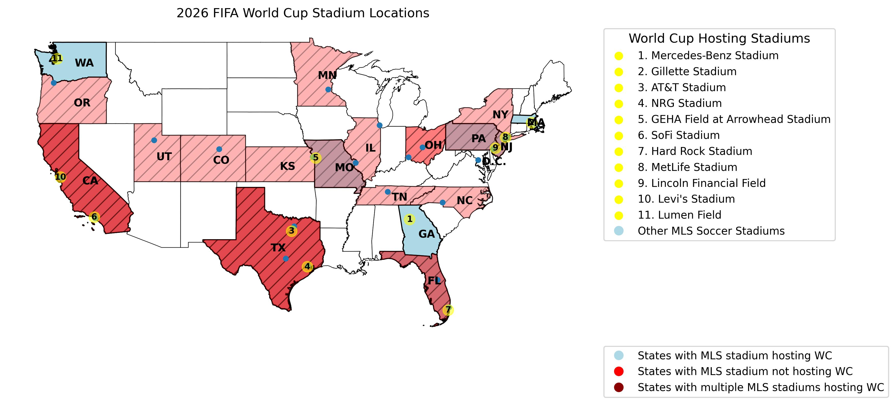
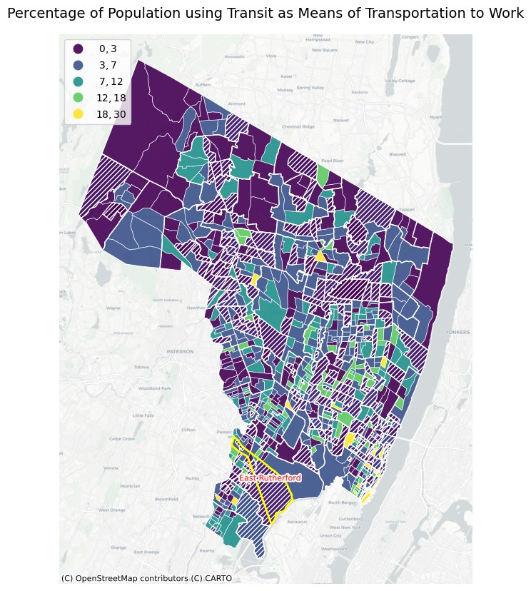

## Amenities Accessible From MetLife Stadium, NJ
# Pavithran Balan
# Command-Line GIS 34:970:595 (Spring 2024)

The aim of this project is to understand if the amenities around MetLife Stadium are accessible in a walking distance. 

The datasets used in this project are all MLS stadium locations in USA, Hotels and restaurants around MetLife Stadium, NJ Transit stop location, ACS (2015-2019) Data to extract the number of people using transit as a means of transportation to work. 

All the locations data were directly obtained from Wikipedia and google. The csv file was used and with the arcgis geocoder, all the locations were geocoded and used for analysis. To find the 15 mins walking buffer from the stadium location, Network analysis was done using OSMnx

Before, jumping into MetLife stadium, let's look at where the Fifa world cup is happening across USA in 2026

As seen in the image, there are many other states with soccer stadiums. To understand what factors would have gone into account to choose where the world cup is hosted, I added the capacity factor to check.

[View Final Stadiums](final_stadiums.html)

As we could see all the stadiums selected for the world cup have higher capacity (>60,000) compared to the non-selected stadiums which had less than 50,000. 

Demographics of Bergen County

Focusing back on the MetLife stadium, it is located in East Rutherford, Bergen County, NJ.

To understand how transit usage is in the county, I used ACS data to visualize the number of people using transit as a means of transportation to work

As seen above, the transit usage in East Rutherford is very low and in general, Bergen County is poor in transit usage showing it's a very car-dependent neighborhood. 

Finally, to check what is accessible from the MetLife stadium, a walking buffer of 15 mins was created 

[View Final MetLife](final_metlife.html)

The map helps us understand that
  1. MetLife stadium is transit accessible within a walking distance
  2. It is not accessible to hotels even though it's right across from the stadium
  3. It is just almost accessible to one Mall/Restaurant
